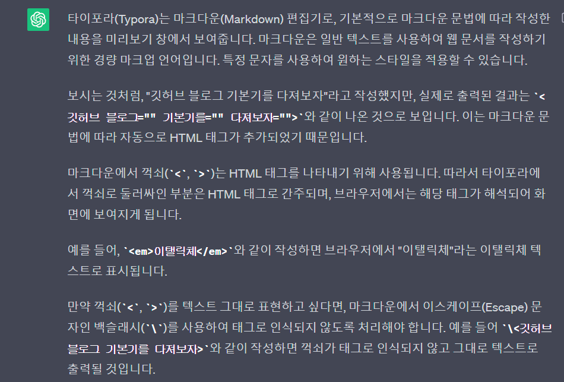

하림아 생각보다 많이 어렵구나,,, 

**\<깃허브 블로그 기본기를 다져보자>**

1\. 	*실시간 반영 체크*

(Ruby 이용해서,  로컬서버 실행하여 실시간으로 확인 가능, default로 localhost:4000으로 실행됨)

​		블로그 경로 폴더에서 powershell(shift+우클릭) ---> bundle exec jekyll serve 입력

2\.	 *타이포라를 이용하여 글 작성 시 유의사항*

정리) 타이포라는 마크다운 언어라 꺽쇠를 HTML 태그로 인식한다. 따라서 꺽쇠를 블로그에서 텍스트 그대로 표현하고 싶다면 \ 을 사용해야 함.  

+HTML형식으로 이해하여, 일반 글쓰기와는 다른 제약이 있다고 인지해야 함

3\. 	0802 여기서 마무리 내일 더 배우자 !
