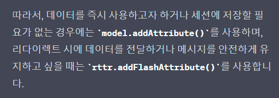

**\<오늘의 고찰>**

Spring MVC 패턴에서 Controller 부분에서

**Model model : model.addAttribute()** 와

 **RedirectAttributes rttr : rttr.addFlashAttribute()**는 어떤 차이인가? 

`model.addAttribute()`: 이 메서드를 사용하면 데이터는 세션에 저장되지 않고, 즉시 해당 페이지에 전달된다. 그러므로 `@GetMapping` 메서드에서 사용하거나, 데이터를 유지할 필요가 없는 경우에 유용하다. 하지만 이 방식은 데이터가 쿼리 매개변수로 노출되므로, URL이 길어질 수 있고 보안에 취약할 수 있다.

`rttr.addFlashAttribute()`: 이 메서드를 사용하면 데이터는 세션에 일시적으로 저장된다. 리다이렉트된 페이지에서만 사용할 수 있으며, 일반적으로 리다이렉트 시에 데이터를 전달할 때 사용된다. `addFlashAttribute()`로 저장된 데이터는 다음 요청까지만 유지되고, 이후에는 삭제된다. 따라서 사용자가 새로고침 등을 하더라도 메시지가 지속적으로 나타나지 않아 안전하게 데이터를 전달할 수 있다.

한 가지 예시로 `model.addAttribute("dto", boardDTO)`는 `read` 메서드에서 `boardDTO`를 `dto`라는 이름으로 해당 페이지에 전달하는 것. 이는 세션에 저장되지 않으며 즉시 사용 가능하다.

끝으로, 지피티 선생님의 정리 글

